# nexC

### Project Overview
nexC is a command-line interface for the game of Nex. This engine provides support for running Nex games amongst players upon a two-way communication link over a network. nexC also includes a Nex visualization tool, called nexViz. This tool can be used to visualize Nex games, either through a text file or a direct input of moves into the webpage.

### Game description
Nex is a connection game played between two players, namely Black and White. This game is a variation of the game of Hex. Fig.0 presents the board upon which this game is played, produced by nexC:

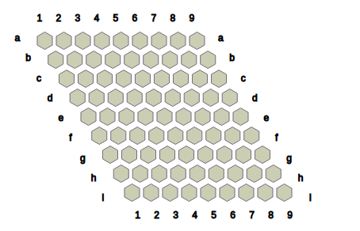

*Fig.0: Initial configuration of the 9 x 9 Nex board.*

The game is played by placing stones on the board, 
turn by turn. By convention, Black plays the first move. There are three kinds of stones: Black (**B**), White (**W**) and Neutral (**?**). Given a state of the game and the player to move, the player may either play a _Generate_ move or a _Transform_ move.

1. Generate move: The player places a stone of their colour and a 
	Neutral stone into two distinct empty cells. 
	
	For example,


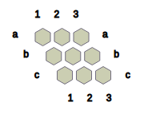
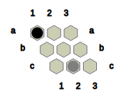


*Fig.1 shows the state obtained after Black plays the move _Ba1?c2_ on the starting position of 3 x 3 Nex, Black places a **B** on _a1_ and a **?** on _c2_.*

2. Transform move: The player converts two Neutral stones on the  board into their colour and convert one of their coloured stones into a Neutral stone. 
	
	For example,

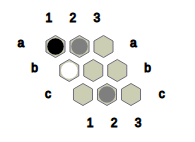

*Fig.3: A game position in 3 x 3 Nex*

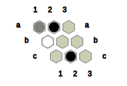

*Fig.4: The state obtained after Black plays the move Ba2Bc2?a1, where Black converts **?** at _a2_ and _c2_ to **B** and **B** at _a1_ to **?**.*


#### Terminology

A cell is _empty_ if it contains no stone.

We say that two cells are connected if both cells are nonempty and both cells contain stones of the same kind.

We define a connection between two cells, A and B, a nonempty sequence of cells such that every consecutive pair of cells in the sequence are connected, with A and B being the first and last cells in the sequence. A connection is a _B-connection_ if every cell in the connection is occupied by a **B** stone. Similarly, a connection is a _W-connection_ if every cell in the connection is occupied by a **W** stone.

The _objective_ for Black is to form a B-connection between some cell in row _a_ and a cell in the bottommost row. Likewise, the _objective_ for White is to form a W-connection between some cell in column _1_ and some cell in the rightmost column. If neither objective is satisfied and there is no legal move that can be played by the player to move, then we conclude that the game has terminated in a _draw_.

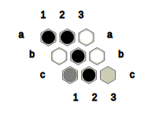

*Fig.5: Black wins this position with the help of the B-connection (a2, b2, c2).*

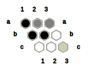

*Fig.6: White wins this position with the help of the W-connection (c1, c2, b3).*

The game terminates when either player wins or no legal
moves exist. Legal moves exist if and only if there are at least
two empty cells for the player to play a generate move or
at least one Neutral stone to allow a transform move to
be playable.

We define an _opening_, or an _opening move_, as the first move played on the initial state of the game. Let S be the initial state of the game. Let A be an opening and S' be the state obtained after playing A on S. We say A is _winning_ if for every A' that can be played on S' there exists a sequence of moves that satifies the objective for Black. Such a sequence is defined as a _winning strategy_ for Black. We say A is _losing_ if there exists a move sequence which satisfies the objective for White. Such a move sequence is defined as the _winning strategy_ for White.

### Utility
Follow the steps below to run the program:
After cloning this repository,

```sh
cd nexc
mkdir obj
make run
```

Now attach each player by running their executables. For instance, to run Solver 1.0:

```sh
cd nexm/solver/
make run
```

##### Communication Protocol
The server and the players are expected to follow the
protocol given below; following are the different input
commands a player may receive from the server:

1. "rR-cC#"

	* Server sends the game settings (format may be extended 
	later). R denotes the number of rows of the board and
	C denotes the number of columns.

2. "!"
	* Due to an unexpected error caused by a player or the
	server, the player must exit with status 1.

3. "?"
	* Server expects the player to send a move in the following
	valid format and type; **"#RC#RC(#RC)"**. An invalid move
	type or format will cause the server to terminate.

4. "+"
	* Server informs the player that it has won the game. The
	player must also terminate upon receiving this input.

5. "-"
	* Server informs the player that it has lost the game. The
	player must also terminate upon receiving this input.

6. "#"
	* Server informs the player that the game ended in a draw.
	The player must also terminate upon receiving this input.

7. ">(...)" (string with '>' as the first character)
	* The substring followed by '>' is the most recent move
	that updated the server state. No response is expected.

### Issues
* Technical
	* Server to be able to run tournaments (/Makefile)
	* Support for Mac and Windows
	* Report search information
		* number of nodes in the game tree
		* number of nodes pruned
		* number of moves simulated
		* time taken to determine a move at various
			depths
		* number of leaf nodes

* Theoretical
	* Game tree complexity

* Implementation
	* Improve algorithms implemented in solver 1.0
	* Good heuristic evaluation
		* number of legal moves available from a state
		* minimum number of stones to win
		* board dominance
		* number of chains
		* weak vs strong connections
		* mustplay regions 
			* preserving strong connections
			* defensive plays

### Nex Problems
* **3x3 Nex**
	1. Find all winning openings for Black and conclude that
		a winning strategy exists for the first player.
	2. Find all weak openings for Black and reason why these
		openings are weak. How can White use these openings
		to perhaps win the game?
* **NxN Nex**
	1. Describe the game tree.
	2. Where should the Neutral stones be placed?
	3. Find strong and weak openings.
	4. How should the game states be evaluated?
	5. Is Nex a first player win game?

### What do we know about Nex so far?
##### Combinatorics behind 2x2 Nex and 2x2 Hex
* Number of openings: 12 in Nex, 4 in Hex
* The opening **Ba1?a2** is the unique winning opening in
	2x2 Nex. Every other opening concludes in a draw.

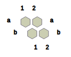
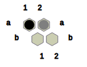
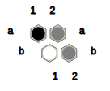
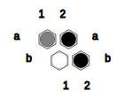

Alternatively, if White responds by **Wb2?b1** to **Ba1?a2**,

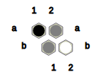
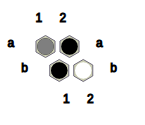

Hence, **Ba1?a2** is indeed a winning opening in 2x2 Nex.

* There are 61 nodes in the game tree of 2x2 Nex, comparing 
	with 65 nodes in the game tree of 2x2 Hex.
##### Solver 1.0 vs Solver 1.0 on 3x3 Nex

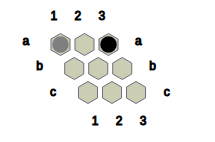
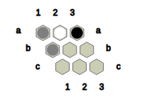
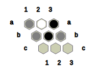
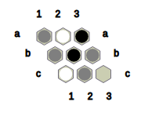
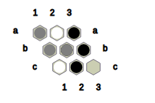

### Nex players
* Solver 1.0
	* implements Alpha-beta Negamax search
	* state space complexity: O(25mn) bytes
	* intractable for boards bigger than 3x3
* Solver 2.0 (Under testing phase)
	* implements Alpha-beta Negamax search
	* state representation using a bitboard, where each cell is denoted using 2 bits
	* state space complexity: O(10mn) bits
	* intractability?
	* drew against Solver 1.0
	* won 8, drew 2, lost 0; against a pseudorandom player
* Random Bits (Coming soon...)
	* will implement Monte Carlo Tree Search
	* state representation as in Solver 2.0
