### Project Overview
dragon is a library of game playing algorithms based on Monte Carlo methods.

NexC is a command-line interface for the playing, simulating and analyzing the game of Nex. NexC also includes NexViz, which is a web-based graphical user interface for playing Nex games as well as analyze games by loading the Game Text Protocol files, or GTP files, generated by NexC.

NexPy is an implementation of the game of Nex that implements algorithms written in the dragon framework.

### Game description
Nex is a connection game played between two players, namely Black and White. This game is a variation of the game of Hex (https://en.wikipedia.org/wiki/Hex_(board_game)). Fig.0 presents a 9 x 9 board upon which this game is played, produced by NexC:

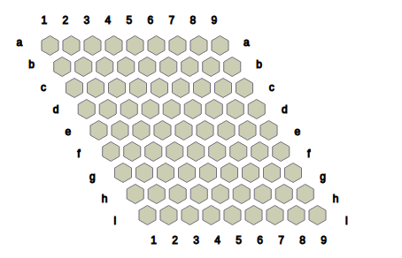

*Fig.0: Initial configuration of the 9 x 9 Nex board.*

The game starts with an empty board. Each cell can contain either a Black (**B**), White (**W**) or a Neutral (**?**) stone. By convention, Black plays the first move by playing a _generate_ move, as defined below.

1. Generate move: The player places a stone of their colour and a 
Neutral stone into two distinct empty cells. 
	
For example,

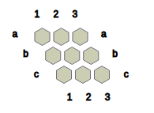
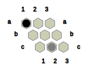

*Fig.1 shows the state obtained after Black places a black stone in cell 1 and a neutral stone in cell c2.*

Alternatively, if a state contains at least two neutral stones, the player may choose to play the following move, called the _transform_ move:

2. Transform move: The player converts two Neutral stones on the board into their colour and convert one of their coloured stones into a Neutral stone. 
	
For example,

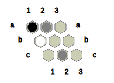
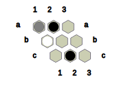

*Fig.4: The state obtained after Black converts **?** at a2 and c2 to **B** and **B** at a1 to **?**.*

#### Terminology

We say that two adjacent cells are connected if both cells are nonempty and both cells contain stones of the same kind.

We define a connection between two cells, A and B, a nonempty sequence of cells such that every consecutive pair of cells in the sequence are connected, with A and B being the first and last cells in the sequence. A connection is a _B-connection_ if every cell in the connection is occupied by a **B** stone. Similarly, a connection is a _W-connection_ if every cell in the connection is occupied by a **W** stone.

The _objective_ for Black is to form a B-connection between some cell in row _a_ and a cell in the bottommost row. Likewise, the _objective_ for White is to form a W-connection between some cell in column _1_ and some cell in the rightmost column. If neither objective is satisfied and there is no legal move that can be played by the player to move, then we conclude that the game has terminated in a _draw_.

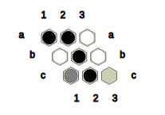

*Fig.5: Black wins this position with the help of the B-connection (a2, b2, c2).*

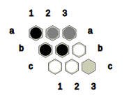

*Fig.6: White wins this position with the help of the W-connection (c1, c2, b3).*

The game terminates when either player wins or no legal moves exist. Legal moves exist if and only if there are at least two empty cells for the player to play a generate move or at least one Neutral stone to allow a transform move to be playable.

We define an _opening_, or an _opening move_, as the first move played on the initial state of the game. Let S be the initial state of the game. Let A be an opening and S' be the state obtained after playing A on S. We say A is _winning_ if for every A' that can be played on S' there exists a sequence of moves that satifies the objective for Black. Such a sequence is defined as a _winning strategy_ for Black. We say A is _losing_ if there exists a move sequence which satisfies the objective for White. Such a move sequence is defined as the _winning strategy_ for White.

### How to use NexC

#### NexC

under construction...

#### NexPy

* Features:
	* implements the game of Nex in Python 3
	* runs domain-independent AI search algorithms implemented in NexPy.ai

### Issues

#### NexC
* Write a single-file library that implements:
	* Negamax search
	* Monte Carlo Tree Search
	* any other two player game search algorithms
* Remove sockets engineering

#### NexPy
* Refactor and officialize AI search algorithms libraries
* Document requirements and use inheritance of a general State class the AI algorithms expect
* Error handlers

#### NexViz
* Complete the webpage
* Connect the webpage to NexPy to be able to play Nex against an AI

### What do we know about Nex so far?
##### Combinatorics behind 2x2 Nex and 2x2 Hex
* Number of openings: 12 in Nex, 4 in Hex
* The opening **Ba1?a2** and **Bb2?b1** are the winning openings in
	2x2 Nex. Every other opening concludes in a draw.

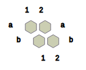
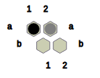
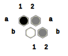
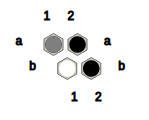

Alternatively, if White responds by **Wb2?b1** to **Ba1?a2**,

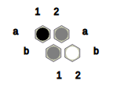
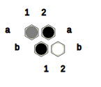

Hence, **Ba1?a2** is indeed a winning opening in 2x2 Nex. Symmetrically, **Bb2?b1** can also be proved to be a winning opening.

* There are 61 nodes in the game tree of 2x2 Nex, comparing 
	with 65 nodes in the game tree of 2x2 Hex.

### Nex players
#### NexC
* PseudoRand
	* Selects a move pseudorandomly
* Solver 1.0
	* Implements Alpha-beta Negamax search
	* Intractable for boards bigger than 3x3
* Solver 2.0
	* Implements Alpha-beta Negamax search
	* Random shuffles the moves before move selection
	* State representation using a bitboard, where each cell is represented using 2 bits
	* Intractable for boards bigger than 3x3
* Solver 3.0 (Coming soon...)
* Random Bits (Coming soon...)
	* state representation as in Solver 2.0

#### NexPy
* mcts
	* Implements Monte Carlo Tree Search
	* Child selection policy: # wins / # visits
	* Can play on boards of all sizes, assuming that the number of simulations is set reasonably

### Nex tournaments
* **December 2, 2018**
	* Game settings:
		* Board size : 3 x 3
		* Time Control : None
		* Handicap : None

	| Black      | White      | Games played | Black won | Draw | White won |
	|:----------:|:----------:|:------------:|:---------:|:----:|:---------:|
	| Solver 1.0 | Solver 2.0 | 2            | 2         | 0    | 0         |
	| Solver 2.0 | Solver 1.0 | 2            | 2         | 0    | 0         |
	| Solver 1.0 | PseudoRand | 5            | 5         | 0    | 0         |
	| PseudoRand | Solver 1.0 | 5            | 0         | 1    | 4         |
	| Solver 2.0 | PseudoRand | 5            | 5         | 0    | 0         |
	| PseudoRand | Solver 2.0 | 5            | 0         | 2    | 3         |

* **May 23, 2018**
	* game settings:
		* board size : 3 x 3
		* time control : none
		* handicap : none

	| black      | white      | games played | black won | draw | white won |
	|:----------:|:----------:|:------------:|:---------:|:----:|:---------:|
	| solver 2.0 | pseudorand | 100          | 100       | 0    | 0         |
	| pseudorand | solver 1.0 | 50           | 1         | 21   | 28        |
	| pseudorand | solver 2.0 | 50           | 2         | 22   | 26        |
	| solver 1.0 | pseudorand | 50           | 50        | 0    | 0         |
	
	* Analysis:
		* PseudoRand vs Solver 2.0 (Game #33)
			Black opens with **Ba3?b3**. (TBC)
		* PsuedoRand vs Solver 2.0 (Game #47)
			Black opens with **Ba3?c2**. (TBC)

* **August 9, 2019**
	* game settings:
		* board size : 3 x 3
		* time control 	: none
		* handicap 		: none

	| black 	  | white 	     | games played | black won | draw | white won |
	|:-----------:|:------------:|:------------:|:---------:|:----:|:---------:|
	| mcts (100)  | mcts (100)   | 100          | 62        | 18   | 20	       |
	| mcts (100)  | mcts (1000)  | 100          | 63        | 14   | 23	       |
	| mcts (1000) | mcts (1000)  | 100          | 61        | 15   | 24	       |

* **August 10, 2019**
	* game settings:
		* board size : 3 x 3
		* time control 	: none
		* handicap 		: none

	* hypothesis:
		* If a generate move exists in a position, disregard any transform moves.

	| black 	   | white 	       | games played | black won | draw | white won |
	|:------------:|:-------------:|:------------:|:---------:|:----:|:---------:|
	| mcts (1000)  | mcts (1000)   | 100          | 65        | 14   | 21	     |
	| mcts (1000)  | mcts (1000)   | 100          | 72        | 17   | 11	     |
	| mcts (1000)  | mcts (1000)   | 100          | 67        | 15   | 18	     |
	| mcts (1000)  | mcts (1000)   | 100          | 66        | 13   | 21	     |

* **August 11, 2019**
	* game settings:
		* board size : 4 x 4
		* time control 	: none
		* handicap 		: none

	| black 	   | white 	       | games played | black won | draw | white won |
	|:------------:|:-------------:|:------------:|:---------:|:----:|:---------:|
	| mcts (1000)  | mcts (1000)   | 100          | 59        | 0    | 41	     |
	| mcts (1000)  | mcts (1000)   | 100          | 47        | 0    | 53	     |
	| mcts (1000)  | mcts (1000)   | 100          | 57        | 0    | 43	     |

### Interesting games to analyze
##### Solver 1.0 vs Solver 1.0 on 3x3 Nex

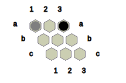
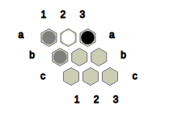
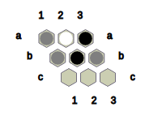
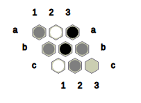
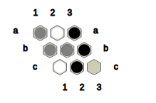

##### Solver 2.0 vs Solver 2.0 on 3x3 Nex

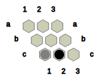
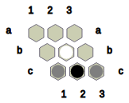
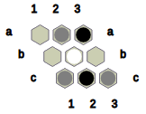
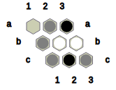
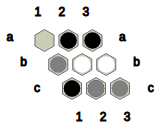
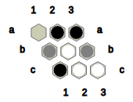
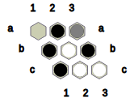

* Move 3, **Ba3?a2**, appears to be a powerful move. This pattern may be useful in developing heuristics for Solver 3.0.

##### Solver 2.0 vs Solver 1.0 on 3x3 Nex

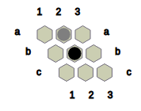
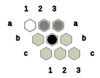
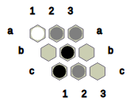
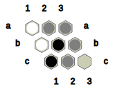
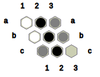

##### Solver 2.0 vs PseudoRand on 3x3 Nex (Draw!)

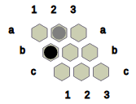
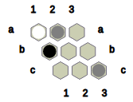
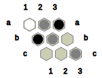
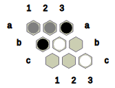
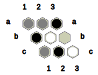
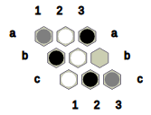
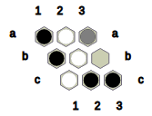

### Contributions

I acknowledge Professor Ryan Hayward from the University of Alberta for inpiring me to undertake this project. I also acknowledge Ragur Krishnan and Shreyansh Jain for their contributions to this project.

EasyAI is an amazing Python3 library and NexPy relies on the algorithms implemented under the EasyAI framework. The developers of EasyAI also have my gratitude.
